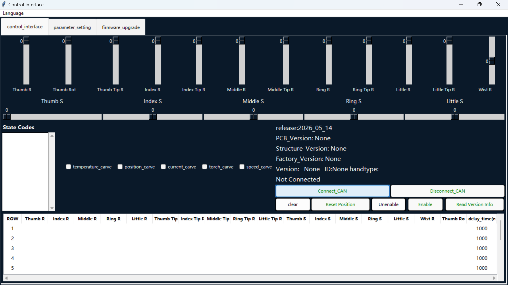
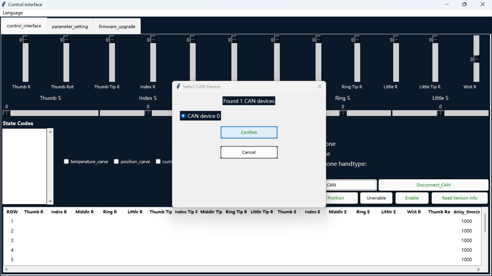
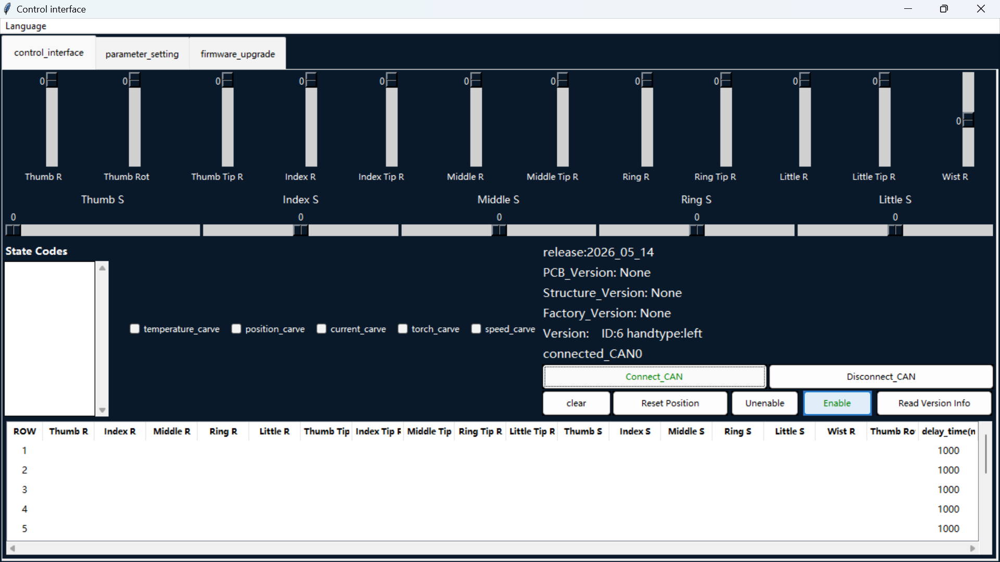
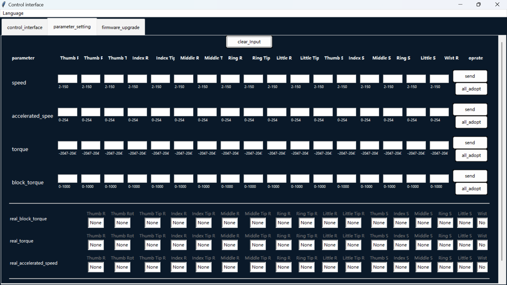
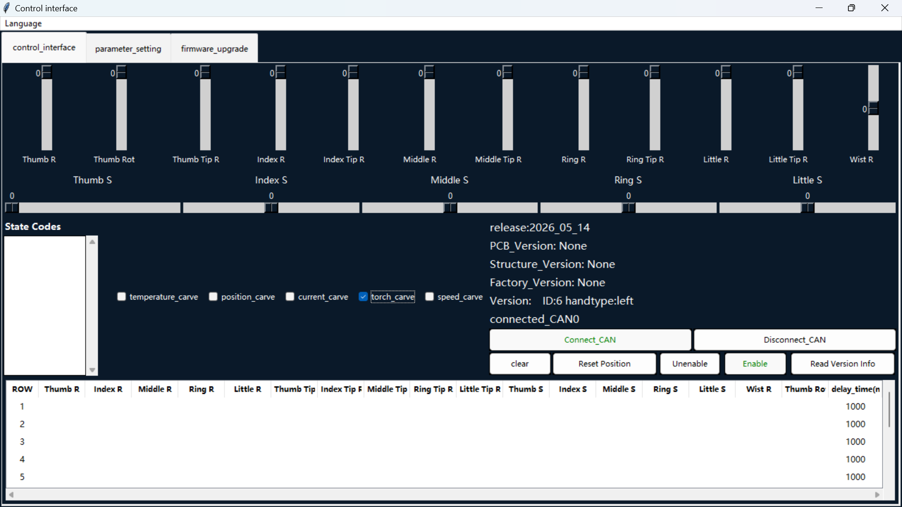
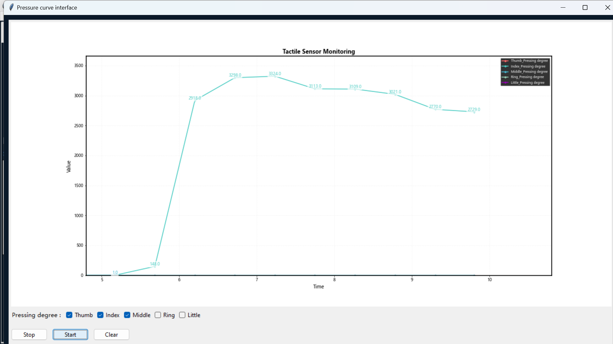

# UI Operating Instructions

### Step 1: Change the UI language

Open the **Language** menu in the top-left corner of the Control Interface.

### Step 2: Select English

Select **English**.

### Step 3: Confirm the language change

The interface is now displayed in English.

### Step 4: Connect the CAN device

On the **control_interface** tab, click **Connect_CAN**.

### Step 5: Confirm the device

Select the detected CAN device, then click **Confirm**.

### Step 6: Enable the device

After the device is connected, click **Enable**.

### Step 7: Control the joints

Move the sliders to control the joints.

### Step 8: Set parameters

Open **parameter_setting**, enter the required values, then click **send** for the row you changed.

### Step 9: View live touch curves

On the **control_interface** tab, select **torch_curve** to view the live touch curves.

Repeat Step 9 to view live temperature, position, current, and speed curves.
